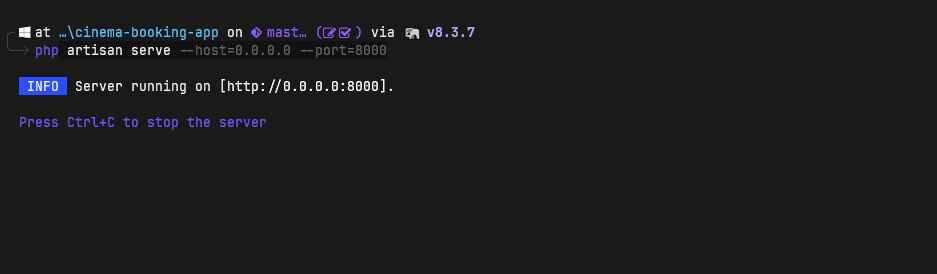

# <font color="#89CFF0">Setup Instruction</font>

## 🚀 Prerequisites
- **PHP:** `^8.3` or higher
- **Package Manager:** Composer
- **Database:** MySQL 8
- **Web Server:** Apache

> 💡 **Tip for Local Windows Computer:** Instead of installing these components individually, you can use local pre-configured environments such as **Laragon**, **XAMPP**, or **WAMP**.

## 🛠️ Laravel Backend Setup

1. Create a new, empty database in your MySQL. 
2. Duplicate <font color="orange">**.env.example**</font> file and rename to <font color="orange">**.env**</font>
3. Please set this variable inside <font color="orange">**.env**</font> file
```
DB_DATABASE=your_database_name
DB_USERNAME=your_database_user
DB_PASSWORD=your_database_password
```
4. Open terminal on this project folder and run this command
    - Run `composer install`
    - Run `php artisan key:generate`
    - Run `php artisan storage:link`
    - Run `php artisan migrate`
    - Run `php artisan db:seed`

# <font color="#89CFF0">Running the Local Server</font>
To start the Laravel development server and make it accessible across your local network, run the following command in your terminal:

```
php artisan serve --host=0.0.0.0 --port=8000
```
Output:


# <font color="#89CFF0">Login Account</font>

This application does not include a public registration feature. To test the booking flow, you can log in using any of the four pre-configured test accounts below:

| User | Email | Password |
| :--- | :--- | :--- |
| User 1 | najmuddin@gmail.com | Password@1 |
| User 2 | alex@gmail.com | Password@2 |
| User 3 | faizuddin@gmail.com | Password@3 |
| User 4 | amirul@gmail.com | Password@4 |

# <font color="#89CFF0">Important Notes You Should Know</font>

### ⚙️ API Scope & Static Data

The backend APIs developed for this project strictly cover the primary booking flow. To meet the assessment timeline, the following supporting data sets are currently static/hardcoded:
- Available showtimes
- Cinema hall layouts and seat maps
- Movie & seat pricing (uniform pricing across all sheets)
- Promo code listings

### 🎯 Out of Scope & Future Enhancements

This implementation focuses purely on the primary booking flow and core wireframes. To keep the core engine clean, the following features were excluded from this version:
- User registration & profiles
- Movie categories (New Release, Popular, Recommended)
- Adding movie reviews, ratings, and a personal "favorites" bookmark list
- User booking history & ticket barcodes
- Bank transfer & crypto wallet payments
- Email notifications

### 🏷️ Promo code (Testing)

A static promo code is available to test the discount logic during the checkout flow:
- Code: PROMO5
- Benefit: RM5.00 flat discount


### 📖 API documentation

Detailed API documentation is automatically generated using Laravel Scribe. You can access the interactive docs directly through your browser at: <br>
`http://<yourIpAddress>/apidocs`

# <font color="#89CFF0">Booking Flow (API)</font>
This section details the end-to-end user booking flow, mapping each user interface screen directly to its corresponding backend REST API endpoint.

### 1. Login Screen
Upon opening the application, unauthenticated users are presented with a login screen. They need to key in email and password.

**API**
```http
POST /api/authenticate
```

### 2. Home Screen

After login, the system loads all currently available movies.

**API**

```http
GET /api/movies
```

**Purpose**
- Display currently showing movies
- Display movie posters and basic information
- Allow users to browse available movies
- Select a movie to view more details.
- Navigate to movie details page

### 3. Movie Details Screen

The system displays detailed information about the selected movie.

**API**

```http
GET /api/movies/{movieId}
```

**Purpose**

- Display synopsis
- Display cast information
- Display director and writers
- Display duration and classification
- Display ratings and reviews
- Watch movie trailer

### 4. Booking Screen

The user selects a cinema, date, and showtime for the movie.

**API**

```http
GET /api/areas
```
```http
GET /api/cinemas
```
```http
GET /api/booking/showtime/unavailable-seats
```
```http
GET /api/booking/ticket
```

**Purpose**

- Display available cinemas
- Select preferred showtime
- Select one or more seats
- Create booking draft
- Display available seats 
    - To keep the seating chart updated and prevent two users from choosing the same seat, the application uses **polling**. This means the app automatically sends a background request to the server every few seconds to fetch the latest layout.

> 💡 **Technical Note:** I am using polling here because it is simple to build for this test. However, for a real app with many users, **WebSockets** is the best choice. WebSockets create a single, permanent connection that sends instant updates only when a seat is taken. This stops the app from making wasteful requests and keeps it running fast.

### 5. Food & Beverage Screen

The user may add food and beverage items to the booking.

**API**

```http
GET /api/fnb/menu
```
```http
GET /api/booking/fnb/{booking_id}
```

**Purpose**

- Display available food and beverages
- Add products to booking
- Skip this step if not required

### 6. Booking Summary Screen

The system displays a summary of the booking before payment.

**API**

```http
GET /api/booking/details/{bookingId}
```
```http
GET /api/booking/redeem-promo/{bookingId}
```

**Purpose**

- Display movie details
- Display selected seats
- Display food & beverage items
- Display pricing breakdown
- Display total payable amount
- Redeem promo code


## 8. Card Payment Screen

The user proceed to the checkout UI to finalize the transaction. This endpoint processes the tokenized transaction details.

**API**

```http
GET /api/booking/payment/{bookingId}
```

**Purpose**

- Display available payment methods
- Select preferred payment option
- Update booking status
